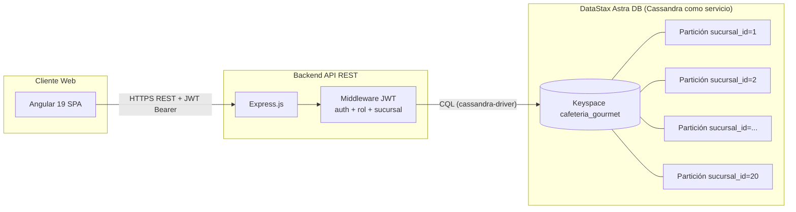
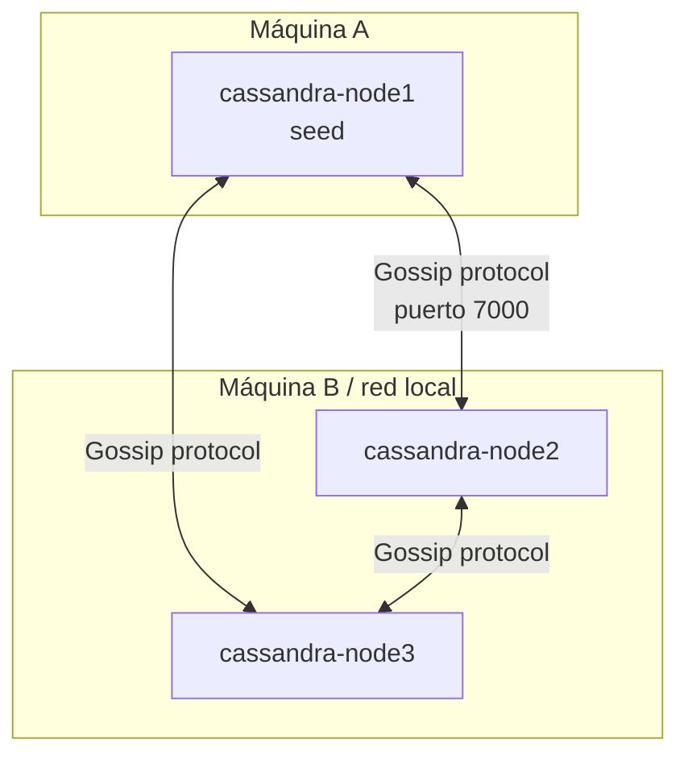
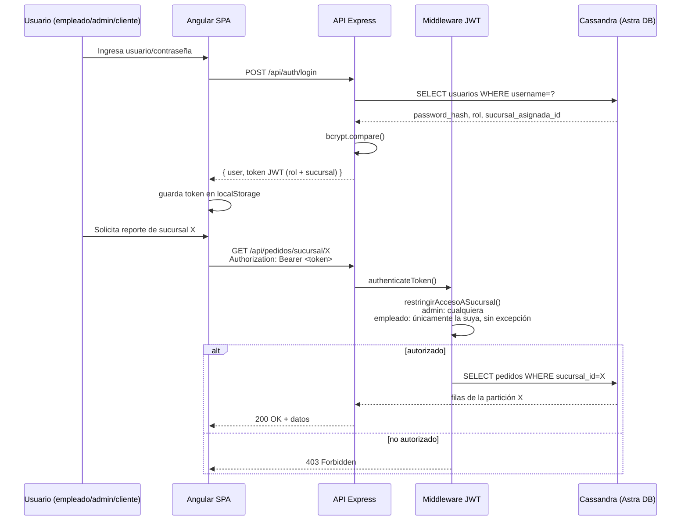

# Cafetería Gourmet — NoSQLatte

Proyecto Final — Base de Datos Distribuidas
Universidad Autónoma de Aguascalientes · Centro de Ciencias Básicas
Departamento de Sistemas Electrónicos · Ingeniería en Sistemas Computacionales

> Documentación teórica, técnica, de diseño de datos y de arquitectura del
> sistema.

---

## 1. Resumen ejecutivo

NoSQLatte es el sistema de ventas de una cadena de tiendas de conveniencia
con **20 sucursales** operando sobre una única base de datos
**distribuida**. Cada sucursal:

- Tiene su propio catálogo de productos e inventario.
- Registra sus propias ventas (altas de pedidos).
- Puede ser consultada de forma independiente en reportes.
- Opera bajo control de acceso: un empleado solo puede **ver reportes** de
  la sucursal a la que está asignado, pero puede **registrar ventas** para
  cualquier sucursal (p. ej. para levantar un pedido a nombre de otra
  tienda); un administrador ve y opera sobre todas.

El sistema está compuesto por tres piezas:

| Capa | Tecnología | Carpeta |
|---|---|---|
| Frontend (cliente web) | Angular 19 (standalone) | `cafeteria-web/cafeteria-web` |
| Backend (API REST) | Node.js + Express 5 | `cafeteria-backend` |
| Base de datos distribuida | Apache Cassandra (vía DataStax Astra DB, cloud) | keyspace `cafeteria_gourmet` |

---

## 2. Marco teórico

El diseño del sistema se apoya en los siguientes conceptos de bases de
datos distribuidas:

- **Modelo de datos de amplia columna (wide-column / Cassandra)**: en lugar
  de un modelo relacional normalizado, las tablas se diseñan a partir de las
  consultas que el sistema necesita resolver ("query-first modeling"),
  desnormalizando deliberadamente.
- **Fragmentación horizontal (sharding) por clave de partición**: Cassandra
  distribuye físicamente las filas entre los nodos del clúster según el
  hash de la **partition key**. La partition key de las tablas de negocio
  es `sucursal_id`, por lo que cada tienda corresponde a una partición
  propia y, en un clúster real, puede vivir en un nodo (o conjunto de nodos
  por replicación) distinto.
- **Replicación**: Astra DB (y el clúster local descrito en la sección 3.2)
  replican cada partición en varios nodos para tolerancia a fallos,
  siguiendo el modelo *peer-to-peer sin nodo maestro* de Cassandra (a
  diferencia de una arquitectura primario-réplica).
- **Consistencia ajustable**: las operaciones usan el nivel de consistencia
  `QUORUM`, balanceando disponibilidad y consistencia (teorema CAP) en vez
  de consistencia estricta o disponibilidad pura.
- **Transparencia de distribución**: el cliente (frontend) y la API nunca
  hablan con un nodo en particular; el driver de Cassandra resuelve a qué
  nodo enrutar cada consulta según la partition key, dando transparencia de
  ubicación y de fragmentación a la capa de aplicación.

---

## 3. Arquitectura del sistema

### 3.1 Arquitectura lógica



- El **frontend Angular** consume la API vía `HttpClient`; un
  **interceptor** (`auth.interceptor.ts`) adjunta automáticamente el JWT de
  la sesión a cada petición.
- El **backend Express** expone endpoints REST y aplica el middleware de
  autenticación/autorización (`authMiddleware.js`) antes de tocar la base
  de datos.
- La **base de datos** es un clúster Cassandra administrado (Astra DB);
  cada una de las 20 sucursales corresponde a una partición lógica
  independiente dentro del mismo keyspace.

### 3.2 Arquitectura física del clúster distribuido

El repositorio incluye en [`docker-compose.yml`](docker-compose.yml) la
definición de un **clúster Cassandra de 3 nodos**, desplegable en dos
máquinas (`MAQUINA_A`, `MAQUINA_B`) usando `GossipingPropertyFileSnitch`,
como representación física del modelo de distribución y replicación que
Astra DB opera de forma administrada:



### 3.3 Flujo de autenticación y autorización



---

## 4. Modelo de datos y fragmentación

Keyspace `cafeteria_gourmet`:

### `pedidos` (ventas / altas)
```
sucursal_id      int        PARTITION KEY   -- fragmenta por sucursal
fecha_pedido     timestamp  CLUSTERING KEY
pedido_id        timeuuid   CLUSTERING KEY
producto         text
categoria        text
cantidad         int
precio_unitario  decimal
total            decimal
username         text
```

### `productos_por_sucursal` (catálogo + inventario)
```
sucursal_id          int     PARTITION KEY   -- fragmenta por sucursal
producto_id          text    CLUSTERING KEY
nombre_producto       text
categoria             text
descripcion           text
precio_unitario       decimal
cantidad_disponible   int
esta_activo           boolean
```

### `usuarios` (cuentas, cualquier rol)
```
username               text  PARTITION KEY   -- catálogo global de cuentas
nombre_completo        text
password_hash          text
rol                    text  -- 'registrado' | 'empleado' | 'admin'
sucursal_asignada_id   int
```

**Roles:**
- `registrado`: rol por defecto de cualquier cuenta creada desde el
  auto-registro público (`POST /api/auth/register`); sin permisos
  especiales, solo identifica al autor de un pedido.
- `empleado`: asignado por un administrador junto con una
  `sucursal_asignada_id` obligatoria; puede registrar ventas para
  cualquier sucursal pero solo ve reportes de la suya.
- `admin`: asignado por un administrador; acceso total a reportes y rutas
  `/api/admin/*`. Ningún usuario puede auto-asignarse `empleado` o `admin`
  desde el registro público (ver sección 5).

**Nota de presentación:** el identificador `sucursal_id` (1–20) es el único
valor persistido y usado por la base de datos y la API; el frontend lo
traduce únicamente para mostrarlo a nombres de colonias/municipios de
Aguascalientes (`NombreSucursalPipe`), sin que esto afecte el modelo de
datos ni la fragmentación.

**Estrategia de fragmentación:** `pedidos` y `productos_por_sucursal` usan
`sucursal_id` como partition key, por lo que cada una de las 20 sucursales
es una partición física independiente: las consultas por sucursal
(`WHERE sucursal_id = ?`) se resuelven en una sola partición sin
`ALLOW FILTERING` y sin tocar datos de otras tiendas. `usuarios` se
mantiene como catálogo global (partición por `username`) porque las cuentas
no pertenecen a una sola tienda (un administrador opera sobre todas).

### Volumen de datos

| Tabla | Registros | Sucursales distintas |
|---|---|---|
| `pedidos` | >250 | 20 (1–20) |
| `productos_por_sucursal` | 200 | 20 (1–20), 10 productos c/u |
| `usuarios` | >200 | — (catálogo global) |

---

## 5. Seguridad y control de acceso

El control de acceso opera en dos capas, con el backend como fuente de
verdad de la autorización:

**Autenticación.** El login emite un **JWT** (firmado con `JWT_SECRET`,
expira en 8h) con `username`, `rol` y `sucursal_asignada_id` embebidos.
Las rutas protegidas exigen el header `Authorization: Bearer <token>`
(`authenticateToken`, en `cafeteria-backend/authMiddleware.js`).

**Autorización por rol.** Las rutas `/api/admin/*` exigen rol `admin`
(`requireRole('admin')`).

**Autorización por sucursal.**
- Al **registrar una venta** (`POST /api/pedidos`), cualquier usuario
  autenticado (incluido `empleado`) puede elegir libremente la sucursal del
  pedido; no se fuerza ni se limita a la sucursal asignada, ya que un
  empleado puede levantar pedidos a nombre de otra tienda.
- Al **consultar reportes** (`GET /api/pedidos/sucursal/:id`,
  `GET /api/reportes/comparativo`), un `empleado` solo puede acceder a la
  sucursal exacta de su token (`sucursal_asignada_id`), sin excepciones; un
  `admin` puede acceder a cualquiera, incluido el comparativo de todas las
  sucursales (`restringirAccesoASucursal`).

**Alta de cuentas con rol controlado.** El registro público
(`POST /api/auth/register`) **siempre** crea la cuenta con `rol: 'registrado'`
y sin sucursal, sin importar lo que envíe el cliente en el body — así se
evita que cualquier persona se autoasigne `admin` o `empleado` manipulando
la petición. Crear un usuario `empleado` o `admin` (con su sucursal, en el
caso de `empleado`) solo es posible desde el panel de administración, vía
el endpoint autenticado `POST /api/admin/usuarios` (protegido por
`requireRole('admin')`).

**Capa de cliente.** Los *route guards* de Angular (`auth.guard.ts`,
`admin-auth.guard.ts`) ocultan rutas según el rol del usuario, y un
**interceptor HTTP** (`interceptors/auth.interceptor.ts`) adjunta el JWT a
cada petición saliente.

### Verificación funcional

| Caso | Resultado |
|---|---|
| Sin token, a cualquier ruta protegida | `401` |
| Token de empleado de sucursal 20 pidiendo su propia sucursal (reporte) | `200` |
| Token de empleado de sucursal 20 pidiendo la sucursal 1 (reporte) | `403` |
| Token de empleado en ruta `/api/admin/*` | `403` |
| Token de administrador en cualquier sucursal o ruta admin | `200` |
| Empleado de sucursal 20 enviando `sucursal_id: 1` al registrar una venta | la venta se guarda en la sucursal 1 (el empleado puede elegir cualquier sucursal) |
| `POST /api/auth/register` enviando `rol: "admin"` en el body | la cuenta se crea igual como `registrado`, sin sucursal |
| Admin creando un usuario `empleado` sin `sucursal_asignada_id` vía `/api/admin/usuarios` | `400` |

---

## 6. Funcionalidades

| Rubro | Endpoint(s) | Pantalla Angular |
|---|---|---|
| **Altas (ventas)** | `POST /api/pedidos` | `registrar-pedido` |
| **Reportes de ventas** (con filtro por rango de fechas y exportación a CSV) | `GET /api/pedidos/sucursal/:id` | `reportes` |
| **Reporte comparativo entre sucursales** (solo admin) | `GET /api/reportes/comparativo` | `reportes` |
| **Administración de productos** | `/api/admin/productos*` | `admin/gestion-productos` |
| **Administración de usuarios** (alta con rol/sucursal controlados, solo admin) | `GET/PUT/DELETE /api/admin/usuarios`, `POST /api/admin/usuarios` | `admin/gestion-usuarios` |
| **Auto-registro** (siempre crea rol `registrado`) | `POST /api/auth/register` | `register` |

---

## 7. Cómo ejecutar el proyecto

### Backend
```bash
cd cafeteria-backend
npm install
# Requiere cafeteria-backend/.env con JWT_SECRET=<valor aleatorio>
npm start        # http://localhost:3000
```

### Frontend
```bash
cd cafeteria-web/cafeteria-web
npm install
ng serve          # http://localhost:4200
```

La conexión a la base de datos usa el *secure connect bundle* de Astra DB
incluido en `cafeteria-backend/secure-connect-nosqlatte-db/`.

---

## 8. Consideraciones de seguridad

El token de acceso a Astra DB y los certificados del *secure connect
bundle* (`cafeteria-backend/secure-connect-nosqlatte-db/`), junto con el
archivo `.env` de configuración de red, se encuentran versionados dentro
del repositorio. Para un entorno de producción, estas credenciales deben
moverse a variables de entorno no versionadas y rotarse desde la consola de
Astra DB.
